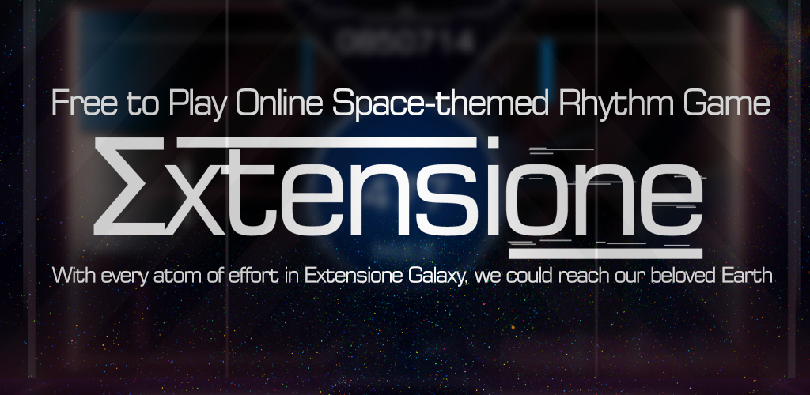
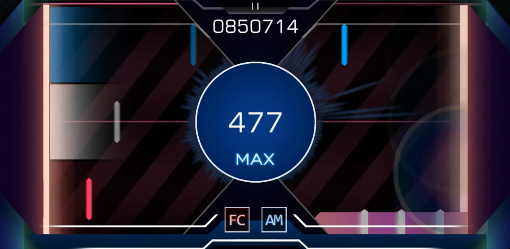

# Extensione | New Dual-Lane Rhythm Game

## Issue Tracker
This github page is mainly targeted for report issues, bugs and discuss features and improvements about Extensione Rhythm Game. If there any issues or bug, please submit it in [Issues](https://github.com/Syafiqjos/Extensione-Issues-Tracker/issues/new) section. Also if you have any advice, features idea or anything let's discuss it too in [Issues](https://github.com/Syafiqjos/Extensione-Issues-Tracker/issues/new) Section.
Please be nice with others on every opened issues.

## Gameplay
Extensione is a new Space-Themed Rhythm Game on Mobile, and it's a one man project, for fun and gains experience to connect with community.
It's available for free on Android which can be downloaded on Google Play Store. Although it's a mobile game it is not available on iOS yet.

## Thank you
Extensione always expanding, increasing and enhancing to create beautiful and fun environment to play. As a planet in the solar system and as a solar system in the universe. Let's make our own Extensione Galaxy vast and vary, so we could reach our beloved earth.
[Youtube](https://www.youtube.com/channel/UCZUqG2Bx8mFDL4JqxcN66WA)
[Instagram](http://instagram.com/syqscode)
Discord : Syafiqjos#3248